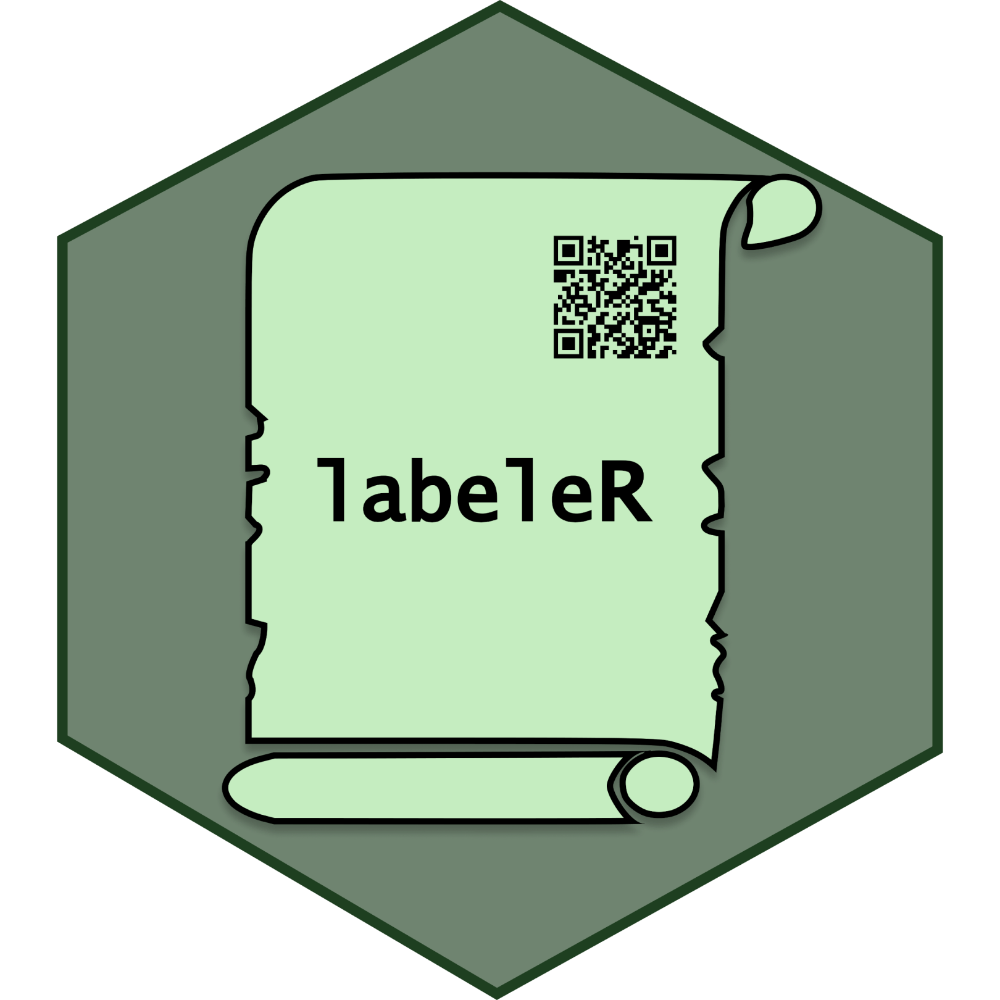

# Files and code needed for Ecoinformatics workshop (AEET)

\par

-   During the seminar previous to the workshop, please download and run the script `labeleR_gettingstarted.R`. It will only install TinyTeX and the LaTeX packages labeleR uses, and it will save some time for the first renderization! (Don't worry, in the future this will not be required!).

- For the workshop, please download the `files` folder and copy it to a working directory of your preferral.

- Specify the directory where you saved the `files` folder as working directory using function `setwd()`
